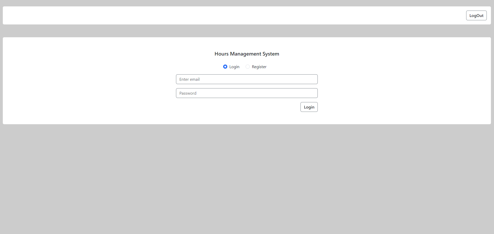
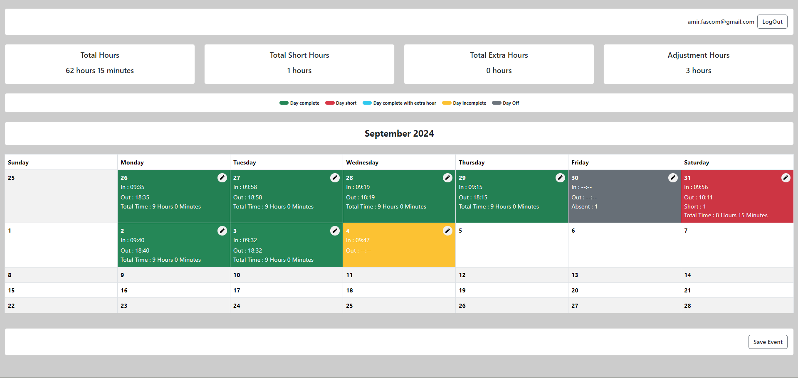

# Hours Management System

The **Hours Management System** is a web application designed to help users track their work hours efficiently. Users can log in/out times, calculate short and extra hours, and get a detailed breakdown of work statistics over a custom month period.

## Features

- **Custom Month Management**: Supports a custom monthly calendar where the month starts on the 26th of the previous month and ends on the 25th of the current month.
- **In/Out Time Tracking**: Record daily in/out times to keep track of work hours.
- **Short and Extra Hours Calculation**: Automatically calculate short hours (less than 9 hours) and extra hours (more than 9 hours) for each workday.
- **Event and Calendar Management**: Add, edit, or delete work hours directly from the calendar interface.
- **Firestore Integration**: Save and fetch work events from Firebase Firestore for persistent data storage.
- **Responsive Design**: Built with Bootstrap for mobile-friendly and responsive UI.
- **Statistics Generation**: Generate monthly statistics such as total hours, short hours, extra hours, and adjustment hours.

## Demo

A live demo of the application is hosted on Firebase. Check it out [here](https://your-firebase-app-url).

## Screenshots




## Tech Stack

- **Frontend**: React.js, Bootstrap
- **Backend**: Firebase Firestore
- **State Management**: React Context API with Reducer
- **Date Manipulation**: Moment.js
- **Build & Hosting**: Firebase

## Getting Started

To get started with the Hours Management System on your local machine, follow the steps below.

### Prerequisites

- [Node.js](https://nodejs.org/en/download/) (v14 or above)
- Firebase account with Firestore enabled
- [Firebase CLI](https://firebase.google.com/docs/cli) (to deploy and host the application)

### Installation

1. **Clone the repository**

   ```bash
   git clone https://github.com/your-username/hours-management-system.git
   cd hours-management-system

2. **Install dependencies**

    ```bash
   npm install

3. **Setup Firebase**

- Setup FirebaseGo to your Firebase Console, create a project, and set up Firestore.
- Create a .env file in the root directory and add your Firebase config variables


    ```bash
    REACT_APP_apiKey=your-api-key
    REACT_APP_authDomain=your-auth-domain
    REACT_APP_projectId=your-project-id
    REACT_APP_storageBucket=your-storage-bucket
    REACT_APP_messagingSenderId=your-messaging-sender-id
    REACT_APP_appId=your-app-id

4. **Start the development server**

    ```bash
   npm start

The app will start running at http://localhost:3000.

### Deploy to Firebase

1. **Build the project**

   ```bash
   npm run build

2. **Deploy**

    ```bash
    firebase deploy

This will upload your built project to Firebase Hosting and make it available via your Firebase app URL.

### Usage

- Track Hours: Add daily work events by selecting dates on the calendar. Enter in/out times, and the system will calculate short and extra hours automatically.
- Save Events: Once all events are added for the month, click the "Save Events" button to store the data in Firestore.
- View Statistics: The system will generate statistics for the month and display them on the dashboard.

### Roadmap

- Add user authentication (using Firebase Auth).
- Implement hourly reports and weekly stats.
- Enable export of data as CSV or PDF.

### Contributing

Pull requests are welcome! For major changes, please open an issue first to discuss what you would like to change. Make sure to update tests as appropriate.